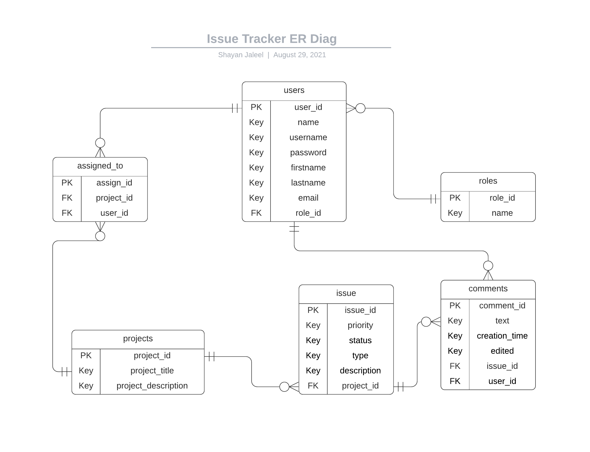

<h1>
    OnTrack

</h1>

Shayan Jaleel

**INTRODUCTION**

**OnTrack** is an issue tracker helpful for tracking bugs and feature requests during product development in a collaborative environment. The main benefit of such a bug-tracking system is to provide a clear centralized overview of development requests (including both bugs and improvements), and their state.

The app can track different projects, each composed of their own set of issues or tickets.

An issue will have, among other things, a priority and a status. After issues have been opened for a project, users can tackle them based on their priority and discuss them in the comments section. When an issue is resolved, it can be marked as closed.

**USERS**

The app has 3 different user types:

* **Developer**: Can add comments to issues and change issue priority and status.
* **Project Manager**: Can assign users to their projects and submit new issues for them.
* **Admin**: An administrator will be able to do everything the other two roles can, and also assign project managers to projects.

**SYSTEM ARCHITECTURE**

**MySQL** was used to create the database and run queries. 

A RESTful service was built using **Spring Boot** with **Hibernate** ORM helping query the database.

**React** was used to create the front-end, with **Redux** handling state management. **Sass** was utilized for **CSS** pre-processing.

The web application is currently deployed to the cloud via **Heroku** with the database served via **JawsDB**. 

**DATABASE DESIGN**

The following ER Diagram represents the different database entities and how they interact.

