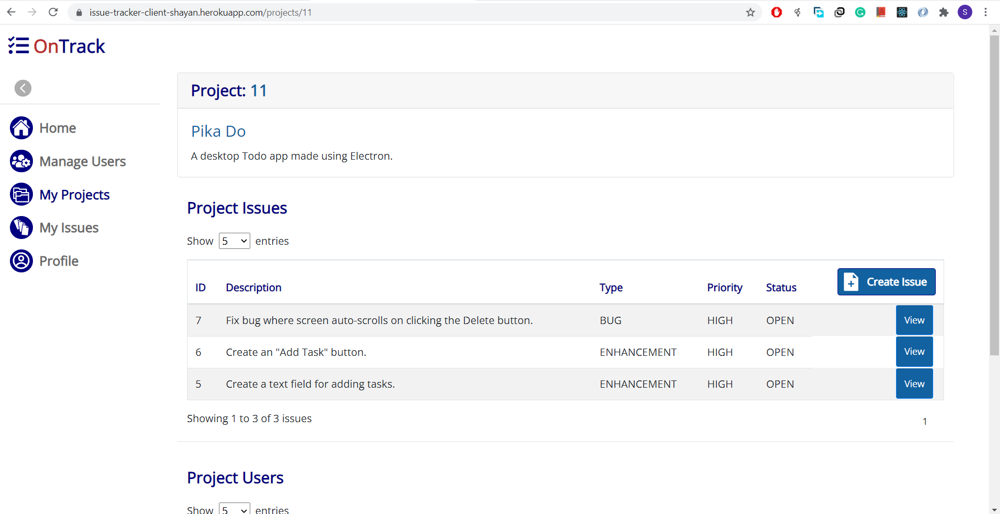
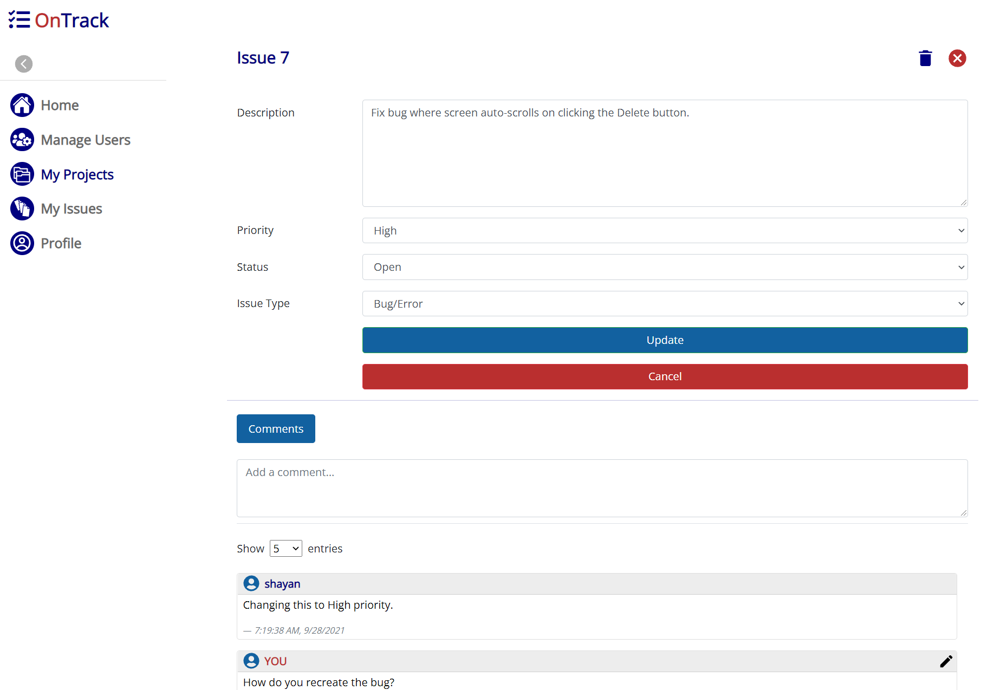
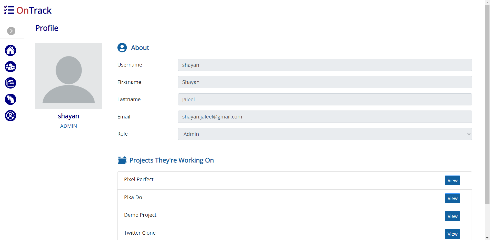

<h1 style="font-weight: bold">
    OnTrack

</h1>

*Mohammad Shayan Jaleel*
 

 

**OnTrack** is an issue tracker helpful for tracking bugs and feature requests during product development in a collaborative environment. The main benefit of such a bug-tracking system is to provide a clear centralized overview of development requests (including both bugs and improvements), and their state.
  

**[Try it out here. Login as Demo Admin](https://issue-tracker-client-shayan.herokuapp.com/)**  
*(The initial load times may be long as the client and server are hosted on Heroku with a free plan. Heroku puts the apps to sleep after 30 mins of inactivity to save dyno hours)*

The app can track different `projects`, each composed of their own set of `issues` or tickets.
  

> 
 

 

An issue will have, among other things, a `priority` and a `status`. After issues have been opened for a project, users can tackle them based on their priority and discuss them in the comments section. When an issue is resolved, it can be marked as closed.
  

> 
 

 

## **USERS**

The app has 3 different user types:

* **Developer**: Can add `comments` to `issues` and change issue properties.
* **Project Manager**: Can assign `developers` to their `projects` and submit new `issues` for them.
* **Admin**: An administrator will be able to do everything the other two roles can, and also assign project `managers` to `projects`.

 

> 

 

## **SYSTEM ARCHITECTURE**

**MySQL** was used to create the database and run queries. 

A RESTful service was built using **Spring Boot** with **Hibernate** ORM helping query the database.

**[You can find the server source code here.](https://github.com/shayan-jaleel/issue-tracker-java-server)**

**React** was used to create the front-end, with **Redux** handling state management. **Sass** was utilized for **CSS** pre-processing.

The app was designed from the ground up to be responsive to all viewport sizes.

 

> 

 

The web application is currently deployed to the cloud via **Heroku** with the database served via **JawsDB**.

## **DATABASE DESIGN**

The following ER Diagram represents the different database entities and how they interact. The schema was designed in the Third Normal Form (3NF).

 

> 

 

